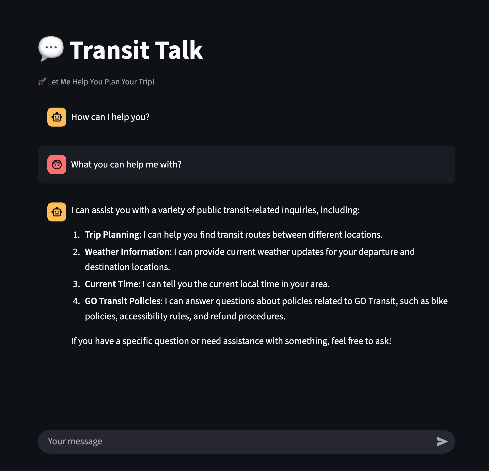
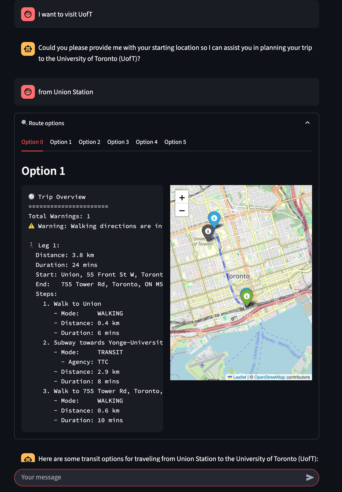

Thanks for sharing the file structure. Based on this, here is a **corrected and improved** version of the `README.md` that aligns with your project layout, including updated file references, better instructions, and improved formatting.

---

# 🚌 Transit Talk

**Transit Talk** is a conversational assistant for planning public transit trips in the Greater Toronto Area. Built using [LangGraph](https://github.com/langchain-ai/langgraph), [Streamlit](https://streamlit.io/), and OpenAI, it enables users to receive real-time routing, alerts, weather, and policy updates—conversationally.

<div align="center">
  
</div>

---

## ✨ Features

* Natural language interface for trip planning
* Real-time route, schedule, and alert info
* Support for accessibility needs (bike, stroller, wheelchair)
* Tools for GO Transit policies and weather lookups
* Persistent memory (when supported locally)
* Visual workflow building with LangGraph Studio

---

## 📦 Project Structure

```bash
transit_talk_repo/
├── app.py                      # Streamlit frontend
├── tools.py                   # All LangGraph tools
├── go_api.py                  # GO Transit API abstraction
├── go_api_simu.py             # GO Transit data simulator
├── src/
│   └── agent/
│       ├── transit_talk_graph.py       # Graph for trip assistant
│       └── tweets_writer_graph.py      # Graph for Tweet Writer
├── transit_talk_graph.py      # (Deprecated or shortcut to src/agent)
├── langgraph.json             # LangGraph Studio configuration
├── styles.css                 # Streamlit app style overrides
├── .env.example               # Sample env config
├── README.md
├── requirements.txt
├── LICENSE
├── Makefile
├── pyproject.toml
└── readme_pic/
    └── transit_talk.png
```

---

## 🚀 Getting Started

### 1. Clone the Repository

```bash
git clone https://github.com/codedai/transit_talk.git
cd transit_talk
```

### 2. Install Dependencies

Create a virtual environment:

```bash
python -m venv venv
source venv/bin/activate  # or venv\Scripts\activate on Windows
```

or use `conda`:

```bash
conda create -n transit_talk python==3.12
conda activate transit_talk
```

Install required packages:
```bash
# LangGraph
pip install -U langgraph
pip install --upgrade "langgraph-cli[inmem]"

# Streamlit
pip install streamlit

# LangChain
pip install -qU "langchain[openai]"
pip install langchain-community

# Utilities
pip install -U googlemaps folium polyline scikit-learn chromadb
pip install -U sentence-transformers   # ⚠️ Large package, may take a while
pip install beautifulsoup4
```

---

### 3. Configure Environment Variables

Create and populate your `.env` file:

```bash
cp .env.example .env
```

Then add your secrets:

```env
MAPBOX_TOKEN=...
GOOGLE_MAPS_API_KEY=...

OPENAI_API_KEY=...
```

See `.env.example` for all available variables.

---

### 4. Start LangGraph Server

```bash
langgraph dev
```

This launches the LangGraph backend and enables visual debugging via Studio.
Ensure the `LANGGRAPH_API_URL` env variable is set (defaults to `http://localhost:2024`).

---

### 5. Start the Frontend (Streamlit)

In another terminal:

```bash
streamlit run app.py
```

Open [http://localhost:8501](http://localhost:8501) in your browser.

---

## 💡 Usage

* Chat naturally:
  *"What's the next GO train from Union Station to York University?"*

  

* Request weather:
  *"Do I need an umbrella at Oshawa GO?"*

* Ask about policies:
  *"Can I bring my bike?"*

* For delay-based social media generation, run the Tweet Writer graph in `src/agent/tweets_writer_graph.py`.

---

## 🧠 Development & Testing

* LangGraph Studio and Streamlit support hot reload.

---

## ⚠️ Known Issues

* 🧠 **LangGraph memory issue:** The hosted LangGraph platform may not support memory during deployment. Use local mode (`inmem`) for memory persistence.
* 🚨 **GO Transit Alert API:** Alerts may fail to load. Mock data is recommended when testing the Tweet Writer agent.

---

## 📝 License

This project is licensed under the [MIT License](./LICENSE).

---

## 🙌 Credits

* Built with [LangGraph](https://github.com/langchain-ai/langgraph), [LangChain](https://www.langchain.com/), and [Streamlit](https://streamlit.io/)
* Data from GO Transit (used for demonstration purposes)
* Project by Jiahao (from [Transit Analytics Lab](https://uttri.utoronto.ca/tal/), University of Toronto)